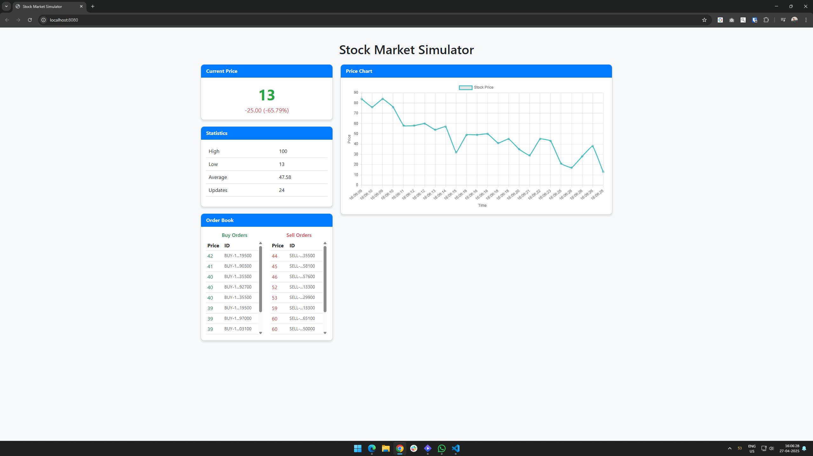

# Stock Market Simulator

A lightweight, Go-based simulation of a single-stock exchange with automatic order matching, price discovery, and real-time visualization.

## Overview

This project simulates a simplified stock exchange that trades a single stock. The simulation includes:

- Automatic generation of buy and sell orders
- Order matching engine based on price compatibility
- Real-time price updates when trades execute
- Binary Search Tree (BST) implementation for efficient order book management
- Web-based UI for visualizing stock prices and order book in real-time
- WebSocket-based communication for live updates

The simulator runs indefinitely, continuously matching buy and sell orders and updating the Last Traded Price (LTP) when matches occur, providing a simplified view of how price discovery works in financial markets.

## Features

- **Single Stock Trading**: Focuses on the mechanics of order matching without the complexity of multiple securities
- **Automated Order Generation**: Creates random buy and sell orders based on the current market price
- **Price Discovery**: Demonstrates how market prices emerge from the interaction of buy and sell orders
- **Efficient Data Structures**: Uses Binary Search Trees for optimal order management
- **Concurrent Processing**: Leverages Go's goroutines for parallel processing of trade matching
- **Real-time Visualization**: Web-based UI showing live price charts and order book
- **WebSocket Communication**: Instant updates to connected clients when market conditions change
- **Price Protection**: Ensures stock prices never go below 1, maintaining market stability
- **Structured Logging**: Comprehensive logging system with different severity levels

## How It Works

The simulator consists of several key components:

1. **Exchange Engine**: Core component that maintains order books and matches trades
2. **Order Books**: Separate Binary Search Trees for buy and sell orders
3. **Order Generator**: Creates random buy and sell orders with prices around the current LTP
4. **Trade Processor**: Periodically checks for matching orders and executes trades
5. **Web UI Server**: Serves the web-based visualization interface
6. **WebSocket Manager**: Handles real-time communication with connected clients
7. **Logger**: Provides structured logging throughout the system

When buy and sell orders match (buy price >= sell price), a trade is executed, the orders are removed from their respective queues, and the Last Traded Price is updated to reflect the new market price. The UI is immediately updated to reflect these changes.

## System Architecture

```
                 ┌─────────────────┐
                 │  Order Generator│
                 └────────┬────────┘
                          │
                          ▼
┌─────────┐      ┌─────────────────┐      ┌─────────────┐
│  Buy    │◄─────┤    Exchange     ├─────►│    Sell     │
│ Orders  │      │     Engine      │      │   Orders    │
└─────────┘      └────────┬────────┘      └─────────────┘
                          │
                          ▼
                 ┌─────────────────┐
                 │ Trade Processor │
                 └────────┬────────┘
                          │
                          ▼
          ┌───────────────────────────┐
          │      WebSocket Server     │
          └───────────────┬───────────┘
                          │
                          ▼
          ┌───────────────────────────┐
          │     Web UI (Browser)      │
          └───────────────────────────┘
```

## Usage

### Running the Simulator

Build and run the simulator:

```bash
go build
./stockmarketsim
```

The program will start generating random buy and sell orders, matching compatible orders, and updating the Last Traded Price. The current LTP will be displayed in the console as trades are executed.

The web UI will automatically start and be accessible at http://localhost:8080 in your web browser.

To exit the simulator, press `Ctrl+C`.

### Understanding the Output

When the simulator is running, you'll see structured log output like:

```
[2025-04-27 15:12:16.163] [INFO] [ProcessTrades] Processing trades
[2025-04-27 15:12:16.163] [INFO] [ProcessTrades] Matched buy order BUY-1745746937164869500 (price: 98) with sell order SELL-1745746937164869500 (price: 86)
[2025-04-27 15:12:16.163] [INFO] [ProcessTrades] LTP: 86
```

Each log entry includes:
- Timestamp
- Log level (INFO, WARN, ERROR, etc.)
- Component name
- Message content

### Using the Web UI

The web-based UI provides a real-time visualization of the stock market:

1. **Price Chart**: Shows the historical price movement of the stock
2. **Current Price**: Displays the current Last Traded Price with change indicators
3. **Statistics**: Shows high, low, and average prices
4. **Order Book**: Displays current buy and sell orders in the market

The UI automatically updates in real-time as trades are executed and new orders are placed. The order book shows:
- Buy orders (green) sorted by price (highest first)
- Sell orders (red) sorted by price (lowest first)

This provides a complete view of market depth and price discovery in action.

#### UI Screenshot



The screenshot above shows the web-based UI with the real-time price chart and order book visualization.

## Implementation Details

### Exchange

The exchange maintains two order books (implemented as Binary Search Trees) - one for buy orders and one for sell orders. It processes incoming orders and attempts to match them based on price compatibility. The exchange now includes a callback system to notify other components (like the UI) when prices change.

### Transactions

Each transaction (order) includes:
- A unique identifier (generated using timestamp and type)
- Type (BUY or SELL)
- Price amount (with protection to ensure prices never go below 1)

### Binary Search Tree

The order books use a Binary Search Tree data structure for efficient insertion, search, and deletion operations, which are critical for fast order matching.

### Concurrency

The simulator uses Go's goroutines and channels to handle concurrent operations:
- Order generation runs in a separate goroutine
- Order acceptance runs in its own goroutine
- Trade processing runs in another goroutine
- WebSocket communication runs in separate goroutines
- UI server runs in its own goroutine
- Mutex locks protect shared resources during updates

### Web UI

The web-based UI is built using:
- HTML5, CSS (Bootstrap), and JavaScript
- Chart.js for real-time price charting
- WebSockets for live data updates
- RESTful API endpoints for initial data loading

### WebSocket Communication

The WebSocket implementation:
- Maintains persistent connections with clients
- Broadcasts price updates in real-time
- Sends order book updates every second
- Handles reconnection automatically
- Uses JSON for message serialization

### Logging System

The structured logging system:
- Supports multiple log levels (DEBUG, INFO, WARN, ERROR, FATAL)
- Includes timestamps, component names, and log levels
- Formats messages consistently across the application
- Allows for component-specific logging

## Customization

You can modify the simulator's behavior by adjusting these parameters:

### In `cmd/main.go`:
- Initial Last Traded Price (default: 100)
- Order generation frequency (default: 5 orders per second)
- Price range for buy orders (default: current price -100 to current price)
- Price range for sell orders (default: current price -25 to current price +100)

### In `ui/server.go`:
- Web UI port (default: 8080)
- Order book update frequency (default: 1 second)

### In `exchange/logger.go`:
- Default log level (default: INFO)
- Log format and output destination

## License

```
MIT License

Copyright (c) 2025 Rohan Dhamapurkar

Permission is hereby granted, free of charge, to any person obtaining a copy
of this software and associated documentation files (the "Software"), to deal
in the Software without restriction, including without limitation the rights
to use, copy, modify, merge, publish, distribute, sublicense, and/or sell
copies of the Software, and to permit persons to whom the Software is
furnished to do so, subject to the following conditions:

The above copyright notice and this permission notice shall be included in all
copies or substantial portions of the Software.

THE SOFTWARE IS PROVIDED "AS IS", WITHOUT WARRANTY OF ANY KIND, EXPRESS OR
IMPLIED, INCLUDING BUT NOT LIMITED TO THE WARRANTIES OF MERCHANTABILITY,
FITNESS FOR A PARTICULAR PURPOSE AND NONINFRINGEMENT. IN NO EVENT SHALL THE
AUTHORS OR COPYRIGHT HOLDERS BE LIABLE FOR ANY CLAIM, DAMAGES OR OTHER
LIABILITY, WHETHER IN AN ACTION OF CONTRACT, TORT OR OTHERWISE, ARISING FROM,
OUT OF OR IN CONNECTION WITH THE SOFTWARE OR THE USE OR OTHER DEALINGS IN THE
SOFTWARE.
```

## Future Enhancements

- Add multiple stocks with different trading characteristics
- Implement more sophisticated order types (limit, market, stop)
- Add realistic market participants with different trading strategies
- Add support for order cancellation and modification
- Implement trading volume statistics and additional market metrics
- Add user-initiated orders through the UI
- Implement historical data storage and replay functionality
- Add authentication for different user roles
- Create mobile-responsive design for the UI
- Implement performance optimizations for high-frequency trading scenarios
- Add simulated news events that affect market behavior
